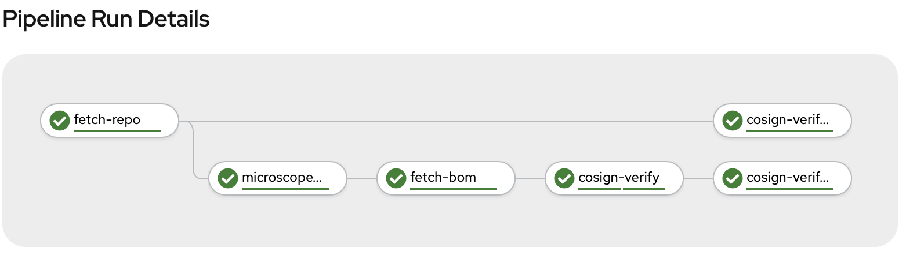

# Running GitSecure on RedHat Openshift Platform Pipeline

NOTE: Following instructions are tested on Openshfit 4.5. 

This is a tekton pipeline that is configured to run on `pull_request` event from the github. On such event, it executes following tasks through the pipeline. It clones the code repository, and scans it to generate a bill-of-material (BoM) that lists all discovered dependencies. Every `base-image` from the BoM, is then verified with `cosign`. It then reports findings back to the developer as new comment in the `pull-request` and also `set-status` to the pull-request.




## Setting up Pipeline

First, setup pipeline components on the cluster

```
$ git clone gitsecure-cosign-pipeline
$ cd gitsecure-cosign-pipeline
$ oc apply -f sample-pr/github-pr-binding.yaml
$ oc apply -f sample-pr/event-listener.yaml
$ oc apply -f sample-pr/trigger-template.yaml
$ oc apply -f sample-pr/pipeline.yaml

$ oc apply -f task-discovery.yaml
$ oc apply -f task-bom.yaml
$ oc apply -f task-cosign-verify.yaml
$ oc apply -f git/git-clone.yaml
$ oc apply -f git/task-set-commit-status.yaml
```

## Settuing up credentials

1. In the `secrets/cosign-pub-key.yaml` add `base64` encoded cosign public key, that can be used to verify images

2. In the `git-ent-secret.yaml`, for `git-ent-secret` --> `password` add the OAuth password to the github account. It is used for cloning the repository, adding comment to the PR and setting status.

3. Again, in the `git-ent-secret.yaml`, for `registry-access-secret` --> `dockerconfigjson` add `base64` encoded `dockerconfig.json` that can be use to authenticate to the docker registry.

4. Then create these secrets on the cluster
```
$ oc apply -f secrets/cosign-pub-key.yaml
$ oc apply -f secrets/gs-access-secrets.yaml
```

## Configuring webhook

1. Expose the `event-listener` service from the cluster
```
$ oc expose svc el-github-pr-listener
```

2. Get the `listener-url `from the cluster
```
$ echo "URL: $(oc  get route el-github-pr-listener --template='http://{{.spec.host}}')"
```

3. On your github code repository, add the `listener-url` in the webhook (select application/json as the payload)

## Experiment
Once configured successfully, you can try making a `pull_request` on your code repository and you should see `pipelinerun` being instantiated on the cluster. Once `pipelinerun` finished, you should see a new comment on the `pull_request` and `status` being set. 